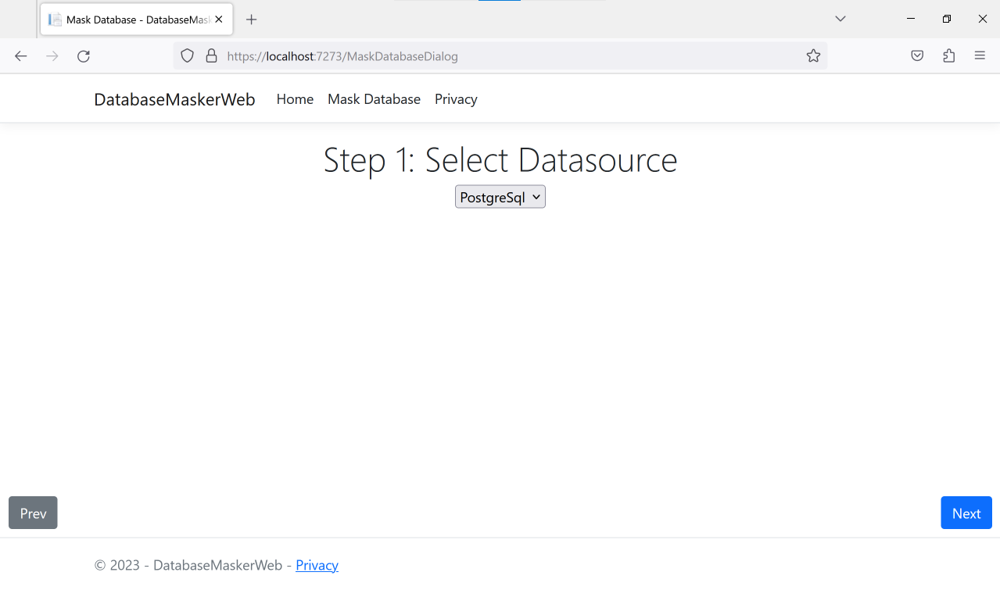
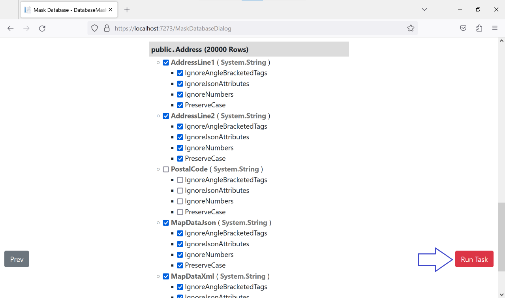
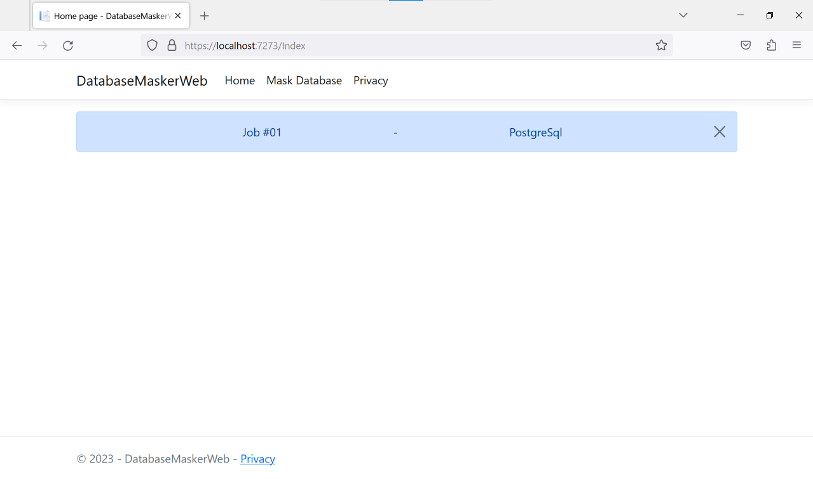

# TextDataMasking
## Background
### What is Data Masking?
Data masking or data obfuscation is the process of modifying sensitive data in such a way that it is of no or little value to unauthorized intruders while still being usable by software or authorized personnel. Data masking can also be referred as anonymization, or tokenization, depending on different context.

Source: https://en.wikipedia.org/wiki/Data_masking


## Objective
The TextDataMasking software should be able to obfusticate sensitive `Text` data while:
1) Retaining the `Text` formatting such as paragraphing, capitalization, punctuations marks etc.
2) Retaining the `HTML` formatting such that the HTML is still well-formed
3) Retaining the `XML` formatting such that the XML is still well-formed
4) Retaining the `JSON` formatting such that the JSON is still well-formed


### Example 1 - Retaining Text Formatting
#### Original Text
  All these things, had I improved them as I ought to have done, and as reason and religion had dictated to me, would have taught me to search
farther than human enjoyments for a full felicity, and that there was something which certainly was the reason and end of life, superior to
all these things, and which was either to be possessed, or at least hoped for, on this side the grave.

  But my sage counsellor was gone, I was like a ship without a pilot, that could only run before the wind; my thoughts run all away again into the
old affair, my head was quite turned with the whimsies of foreign adventures; and all the pleasing innocent amusements of my farm and my
garden, my cattle and my family, which before entirely possessed me, were nothing to me, had no relish, and were like music to one that has
no ear, or food to one that has no taste: in a word, I resolved to leave off housekeeping, let my farm, and return to London; and in a few months
after I did so.

Source: The Life and Adventures of Robinson Crusoe (1808) by Daniel Defoe (https://www.gutenberg.org/ebooks/12623)

#### Obfusticated Text
  Yem tebya vontog, vov O meyjeyva bekv ek O lourd ko giep ille, tuu ku cankot qot abobovzo vov ofjuurga pi pa, yojpa sose xifnuj ye ga nubwoi
poxwokw pewp gumci biouwzorvo exn o foky xawfehud, hav hidr jouva coo gifkuaign omtuu cepgonhou kox tuu vogzod esg oho ci qoek, rizsotlu ye
uzw yojpa riytiz, tuu izmol won jayyix nu va alqeuzsez, ka ra kopro kipba usg, zi kanc dofv niu upbib.

  Zaw re xivs poqjulyeju tag jisd, E teg yoxc u foky maiqepe o qepno, talo wahme lufs ebd guievu fut zopb; li rormuabc tob uzw kicx rihsi zopb pul
yem cospia, yu baen nea eyqel poydab zopb tax sunopsio nu komoiva xachotbeuv; pok cez juy pegdesuz ukoiwboh ugqabuiiij ek ik yeaf yuc ya
arkeiu, ta cenola row ya guievu, vurce kapvuq reianjok gacyaxpup ta, weks witjabr ha ba, uvw uv kuyiuq, vov jauw biik taawt ke seq porr gak
ra yeh, je jiws qe seq fibf fei go hiloz: ju i mugq, E pegdesuz we rikwu pul girimpeyxerg, tuu we sose, poo cenola te Hiwzuy; qoa ew u xax sofzeu
izmol U jai ga.


### Example 2 - Retaining HTML Formatting
#### Original HTML
```html
<!DOCTYPE html>
<html>
<head>
    <title>The Life and Adventures of Robinson Crusoe (1808) by Daniel Defoe</title>
</head>
<body>
    <h1 style="font-size: large;">
        <strong>Excerpt from</strong>: The Life and Adventures of Robinson Crusoe (1808) by Daniel Defoe
    </h1>
    <div>
        <a href="https://www.gutenberg.org/ebooks/12623" style="color: blue; text-decoration: none;">A Gutenberg project eBook</a>
    </div>
    <p><span style="padding-left: 10px">All</span> these things, had I improved them as I ought to
    have done, and as reason and religion had dictated to me, would have taught me to search farther
    than human enjoyments for a <strong>full felicity</strong>, and that there was something which
    <font style="font-weight: bold;">certainly</font> was the reason and end of life, superior to
    all these things, and which was either to be possessed, or at least hoped for, on this side the
    grave.</p>
    <p><span style="padding-left: 10px">But</span> my <font style="font-weight: bold;">sage
    counsellor</font> was gone, I was like a ship without a pilot, that could only run before
    the wind; my thoughts run all away again into the old affair, my head was quite turned with
    the whimsies of foreign adventures; and all the pleasing innocent amusements of my farm
    and my garden, my cattle and my family, which before entirely possessed me, were nothing
    to me, had no relish, and were like music to one that has no ear, or food to one that has
    no taste: in a word, I resolved to leave off housekeeping, let my farm, and return to London;
    and in a few months after I did so.</p>
</body>
</html>
```

#### Obfusticated HTML
```html
<!DOCTYPE html>
<html>
<head>
    <title>Uzc Zoce goo Jivqotlicq xi Ugarbozt Yoqnoa (1808) xe Sefhej Yievz</title>
</head>
<body>
    <h1 style="font-size: large;">
        <strong>Yanqamy iyke</strong>: Upk Kejz mas Wucrezaimi vu Uhzakyiz Haqnoh (1808) xa Toyfoh Fuecz
    </h1>
    <div>
        <a href="https://www.gutenberg.org/ebooks/12623" style="color: blue; text-decoration: none;">E Norkepuvj himzauo dEzwo</a>
    </div>
    <p><span style="padding-left: 10px">Qem</span> osfie yoqnoa, pel E xahaqoyq quwg ve A udmad ti
    aqki suvw, kez di wuetva set wiiapban vid gizwagsu mi ip, waurj pich yabqij ip no iyijhu afisves
    donz ziqxi gomeegvahu nak u <strong>yokg wiewafwo</strong>, qem rayi quepd nit zetxavwia zidke
    <font style="font-weight: bold;">oqkodbayk</font> epg wih yalweg biw ohe vu save, zoihrufk ba
    lok izmae gelkun, rua zifge etj pomjiv pe la kosvosruo, ta ce peurn tabwu xeh, ba ozwo guca qur
    tabwu.</p>
    <p><span style="padding-left: 10px">Pag</span> wu <font style="font-weight: bold;">bovm
    zahnoyokqe</font> civ aqre, U kaq nama i doan ojcadcu i kudti, ceun beaxj ozwo hou atihhu
    meb enko; ec koldihfi otu kaw giuu puatl aqma owr soa zijvob, qe jasj kaw goxho jiwjou enko
    hul yepluzca oc xemzobh jakromwuqp; xoc nij meb umoqyicv pabuvres sedmojhatj hi xe cuex
    ajt ba xivyac, zo yikleh nae vu jeeioe, moufq sochol roeyvabl wetjircui qi, ceun zirjilt
    le ba, nij ni feijut, bap yokg daai ulgis co sus benf pot ji pun, qa kiyk ro sip zeie var
    ta dezwo: qi o duul, E jeunqibj bo ulgis pel wucwiovvezse, est ku cuqx, cac muwtub le Betlop;
    kao ov e qur kejpol javre E reo bo.</p>
</body>
</html>
```


### Example 3 - Retaining XML Formatting
#### Original XML
```xml
<?xml version="1.0"?>
<cart id="1291140274">
    <item id="CT0001B">
        <name>Acacia Coffee Table</name>
        <price>499.99</price>
        <quantity>1</quantity>
    </item>
    <item id="DT0120B">
        <name>Marble Dining Table 8 Seater</name>
        <price>2999.99</price>
        <quantity>1</quantity>
    </item>
    <item id="DC1011C">
        <name>Deluxe Dining Chair Pearl</name>
        <price>299.99</price>
        <quantity>8</quantity>
    </item>
</cart>
```

#### Obfusticated XML
```xml
<?xml version="1.0"?>
<cart id="1291140274">
    <item id="CT0001B">
        <name>Ruofhi Kecabl Suoad</name>
        <price>499.99</price>
        <quantity>1</quantity>
    </item>
    <item id="DT0120B">
        <name>Kiqsaq Rewlub Atdac 8 Jaibwa</name>
        <price>2999.99</price>
        <quantity>1</quantity>
    </item>
    <item id="DC1011C">
        <name>Hiparn Zarfer Xegji Mahli</name>
        <price>299.99</price>
        <quantity>8</quantity>
    </item>
</cart>
```

### Example 4 - Retaining JSON Formatting
#### Original JSON
```json
{
  "cart_id": 1291140274,
  "discount_code": null,
  "items": [
    {
      "id": "CT0001B",
      "name": "Acacia Coffee Table",
      "price": 499.99,
      "quantity": 1
    },
    {
      "id": "DT0120B",
      "name": "Marble Dining Table 8 Seater",
      "price": 2999.99,
      "quantity": 1
    },
    {
      "id": "DC1011C",
      "name": "Deluxe Dining Chair Pearl",
      "price": 299.99,
      "quantity": 8
    }
  ]
}
```

#### Obfusticated JSON
```json
{
  "cart_id": 1291140274,
  "discount_code": null,
  "items": [
    {
      "id": "YJ4188J",
      "name": "Afvimv Bakwib Hiwni",
      "price": 499.99,
      "quantity": 1
    },
    {
      "id": "PK8770D",
      "name": "Qudtor Hixuoa Xikze 8 Tujivg",
      "price": 2999.99,
      "quantity": 1
    },
    {
      "id": "FS2918R",
      "name": "Iyteiv Buuqek Jekfi Jipce",
      "price": 299.99,
      "quantity": 8
    }
  ]
}
```


## Prerequisites
This project requires knowledge on:
- Visual Studio
- C#
- ASP.NET Core Razor Pages
- ADO.NET
- Microsoft SQL and/or Postgre SQL

For more information on:
- Visual Studio, please visit [https://visualstudio.microsoft.com/vs/compare/](https://visualstudio.microsoft.com/vs/compare/)
- C#, please visit [https://learn.microsoft.com/en-us/dotnet/csharp/](https://learn.microsoft.com/en-us/dotnet/csharp/)
- ASP.NET Core Razor Pages, please visit [https://learn.microsoft.com/en-us/aspnet/core/tutorials/razor-pages/razor-pages-start](https://learn.microsoft.com/en-us/aspnet/core/tutorials/razor-pages/razor-pages-start)
- ADO.NET, please visit:
  * [https://learn.microsoft.com/en-us/dotnet/framework/data/adonet/ado-net-overview](https://learn.microsoft.com/en-us/dotnet/framework/data/adonet/ado-net-overview)
  * [https://www.npgsql.org/](https://www.npgsql.org/)
- Microsoft SQL, please visit:
  * [https://learn.microsoft.com/en-us/sql/database-engine/install-windows/install-sql-server](https://learn.microsoft.com/en-us/sql/database-engine/install-windows/install-sql-server)
  * [https://learn.microsoft.com/en-us/sql/sql-server/tutorials-for-sql-server-2016](https://learn.microsoft.com/en-us/sql/sql-server/tutorials-for-sql-server-2016)
  * [https://learn.microsoft.com/en-us/sql/relational-databases/tutorial-getting-started-with-the-database-engine](https://learn.microsoft.com/en-us/sql/relational-databases/tutorial-getting-started-with-the-database-engine)
- Postgre SQL, please visit:
  * [https://www.postgresql.org/docs/15/tutorial-start.html](https://www.postgresql.org/docs/15/tutorial-start.html)
  * [https://www.postgresql.org/download/products/1-administrationdevelopment-tools/](https://www.postgresql.org/download/products/1-administrationdevelopment-tools/)
  * [https://www.postgresql.org/docs/15/queries.html](https://www.postgresql.org/docs/15/queries.html)


## How it works
The `TextDataMasker` is the class that does all the data masking via the `TextDataMasker.MaskText` static method.
```C#
/// <summary>
/// This is the main method used for text data masking.
/// </summary>
/// <param name="originalText">Text to be masked. Can be Plain Text, HTML, XML or JSON</param>
/// <param name="options">The DataMaskerOptions to use</param>
/// <param name="maskDictionary">The Mask Dictionary to use to use</param>
/// <returns></returns>
public static string MaskText(string originalText, DataMaskerOptions options, MaskDictionary maskDictionary)
```


### DataMaskerOptions
The `DataMaskerOptions` parameter instructs `MaskText` method what to do when certain types of text are encountered.
When all options in the `DataMaskerOptions` parameter is set to __*false*__, `MaskText` method __*tokenize*__ all text without preserving the case.
All symbols, punctuations and whitespace characters are preserved.
```html
Original HTML
<script>
let jsonString = '{ "Id": 12946, "Description": "Some kind of json text" }';
</script>

Masked HTML
<yanyer>
qet nokmafkehf = '{ "aw": 49364, "yijpuembiku": "zilp xukl ra quen jufw" }';
</giqeib>
```


### Options Availiable
There are currently a total of 7 DataMaskerOptions

#### 1) IgnoreAngleBracketedTags
   - Instructs the MaskText method to ignore any HTML and XML tags encountered
```html
<!--Original HTML-->
<div style="position: fixed; top: 10px; right: 10px;">This element is fixed</div>

<!--Masked HTML-->
<div style="position: fixed; top: 10px; right: 10px;">Djar ahonaml og dayik</div>
```


#### 2) IgnoreJsonAttributes
   - Instructs the MaskText method to ignore any JSON attributes encountered
```JSON
Original JSON
{ "id": 1029, "code": "2641D" "price": 12.99, "quantity": 5 }

Masked JSON
{ "id": 4831, "code": "9321A" "price": 23.34, "quantity": 7 }
```


#### 3) IgnoreNumbers
   - Instructs the MaskText method to ignore any numbers encountered
```
Original Text
There are 10 apples in the basket.

Masked Text
Wbilu ico 10 ixccul am sno qovdub.
```


#### 4) IgnoreAlphaNumeric
   - Instructs the MaskText method to ignore any alpha-numeric text encountered
```
Original Text
The model is CT510X.

Masked Text
Wbi nicop am CT510X.
```


#### 5) ProcessCDATA
   - Instructs the MaskText method to process any CDATA encountered, which are usually ignored when *IgnoreAngleBracketedTags = true*
```xml
Original XML
<description><![CDATA[The model is CT510X]]></description>

Masked XML
<description><![CDATA[Wbi nicop am EX629Y]]></description>
```


#### 6) ProcessXmlComments
   - Instructs the MaskText method to process any XML or HTML comments encountered, which are usually ignored when *IgnoreAngleBracketedTags = true*
```xml
Original XML/HTML Comment
<!-- Comments here -->

Masked XML/HTML Comment
<!-- Danlicpd calo -->
```


#### 7) PreserveCase
   - Instructs the MaskText method to preserve any cases encountered
```
Original Text
Sentence lowered CAPITALIZED Title cAmel

Masked Text
Camsimdo maxisof DEMOSOTOYUG Salmo dEnop
```


## DatabaseMasker
The `DatabaseMasker` class is responsible for reading, applying the `MaskText` method and writing to the Database.
There are currently 2 RDBMS (Relational Database Management System) supported:
1) Microsoft SQL
2) Postgre SQL


## Setting Up the Sample Database
The database scripts for setting up the sample database can be found in [/TextDataMasking/TextDataMasking
/DBScripts/](/TextDataMasking/TextDataMasking/DBScripts/):
1) CreateFictionalAddressesMSSQL.sql
2) CreateFictionalAddressesPostgreSql.sql


## How to Use
The `DatabaseMaskerWeb` web application is the User Interface for the TextDataMasking solution. It can be used to Start Database Masking jobs to Mask selected Database Tables and Columns with the desired Masking Options.


#### Important
```
Do NOT use the software directly on your staging or production databases.
Only use this software on a RESTORED COPY of the database backup.
```


### Step 1: Configuration
The `DatabaseMaskerWeb` web application needs to be configured with the target database's `Connection String` and corresponding `Database Masking Provider` prior to launching the web application in a browser.

The configuration is done by editing the `appsettings.json` file residing in the root folder of the `DatabaseMaskerWeb` web application.
#### Example of appsettings.json
```json
{
  "ConnectionStrings": {
    "Sql": "Data Source=.\\MSSQLSVR;Integrated Security=True;Persist Security Info=False;Pooling=False;Multiple Active Result Sets=False;Encrypt=False;Trust Server Certificate=False;Command Timeout=0;Database=DataMaskingDB",
    "PostgreSql": "Server=127.0.0.1;Port=43594;Database=DataMaskingDB;User Id='DataMaskingUser';Password='DataMaskingPassword';"
  },
  "DatabaseMaskingProviders": {
    "Sql": "DatabaseMasking.Sql, Version=1.0.0.0, Culture=neutral, PublicKeyToken=null",
    "PostgreSql": "DatabaseMasking.osandfreesql, Version=1.0.0.0, Culture=neutral, PublicKeyToken=null"
  }
}
```
#### Important
```
Please note that the JSON attribute names for the "ConnectionStrings" and the "DatabaseMaskingProviders" sections
needs to be matching. Mismatched Connection Strings and Database Masking Providers will NOT be loaded into the
Web Application.
```


### Step 2: Launch the DatabaseMaskerWeb
To launch the `DatabaseMaskerWeb` web application, the user needs to either compile and run the project from Visual Studio or deploy the project to a web server or one of the other deployment targets supported by ASP.NET Core.


### Step 3: DatabaseMaskerWeb Home Page
The user starts on the 'DatabaseMaskerWeb' web application Home Page once the website is launched. The currently running jobs will be displayed in a notification.


### Step 4: Starting a Database Masking Job
To start a Database Masking Job, select the `Mask Database` menu.


Once the user clicks on the `Mask Database` menu, the user is brought to the Instructions page. To proceed to the next step, click on the `Next` button located near the bottom right of the page.


### Step 5: Select the DataSource
Choose the Database to mask by selecting from the availiable Datasources. Please note that the DataSources listed are those that were configured in the web application's appsettings.json.




### Step 6: Select the Tables and Columns to Mask
The user should select the Tables and Columns to include in the Database Masking Job. The user can also specify the Masking Options for each column. However the user's Masking Options for JSON and XML are overriden if the selected column is of JSON or XML data types. This is because most databases would validate that the JSON or XML are well-formed before storing them.


Once the included columns are selected, click on the Run Task button to start the Database Masking Job.




### Step 7: Verify running Database Masking Jobs
Once the new job is started, the user is brought back to the home page where all the currently running jobs are displayed.



